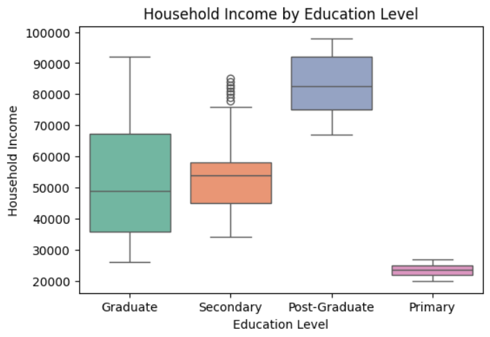
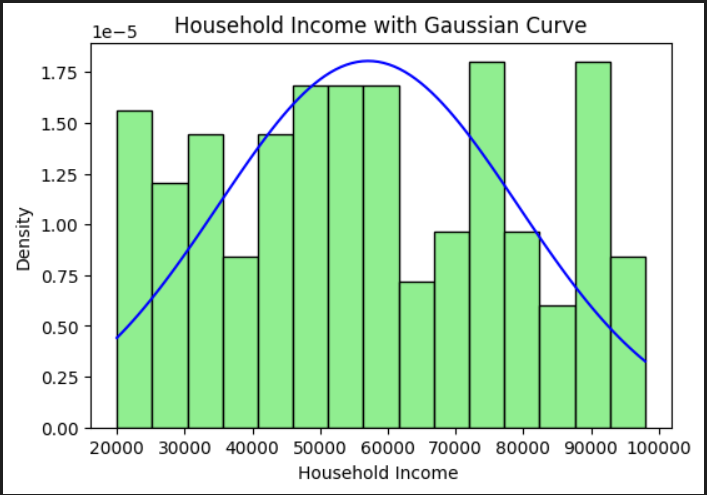

# 📊 Socio-Economic Household Data Analysis  
## Descriptive Statistics & Distribution Analysis
---

## 📌 Project Overview

This project is a **descriptive statistical analysis** of socio-economic household data.  
It focuses on understanding **income distribution, education impact, demographic patterns, and variability** using statistical concepts and visualizations.

The project is designed as an **academic + portfolio-ready data analysis project**, demonstrating strong foundations in:
- Statistics
- Data understanding
- Visualization
- Interpretation of real-world data

## 🎯 Objective  
This project analyzes household-level data to understand patterns related to **income, age, education level, family size, and living conditions**.

The objective is to:
- Identify types of data (Numerical & Categorical)
- Apply descriptive statistical techniques
- Analyze income distribution
- Measure skewness and kurtosis
- Visualize socio-economic trends using Python

---

## 🗂 Dataset Overview
The dataset contains **150+ records** generated using an AI tool.

### 📌 Dataset Columns
| Column Name | Data Type | Description |
|------------|----------|-------------|
| Household_ID | Categorical | Unique household identifier |
| Age_of_Household_Head | Numerical | Age of household head |
| Household_Income | Numerical | Monthly household income |
| Education_Level | Categorical | Primary / Secondary / Graduate / Post-Graduate |
| Family_Size | Numerical | Number of family members |
| Owns_House | Categorical | Yes / No |
| Urban_Rural | Categorical | Urban or Rural |

### 🔗 Dataset File

- [dataset.csv](./dataset.csv)

---

## 🧠 Project Tasks Breakdown

### 🔹 Part A: Theory & Definitions
- Types of Data: Numerical vs Categorical  
- Types of Statistics: Descriptive vs Inferential  
- Central Tendency:
  - Mean
  - Median
  - Mode  
- Measures of Dispersion:
  - Range
  - Variance
  - Standard Deviation  
- Distribution Concepts:
  - Gaussian (Normal) Distribution  
  - Log-Normal Distribution  
  - 3-Sigma Rule (Empirical Rule)  
  - Percentiles & Quartiles  
  - Five Number Summary  
  - Skewness  
  - Kurtosis  

---

### 🔹 Part B: Practical Analysis
- Identification of categorical and numerical columns
- Calculation of Mean, Median, and Mode for:
  - Household Income
  - Age
- Measures of dispersion:
  - Range
  - Variance
  - Standard Deviation
  - Interquartile Range (IQR)
- Distribution analysis of household income
- Income comparison across:
  - Education Levels
  - Urban vs Rural households

---

## 📈 Visualizations
- Histogram of Household Income
- Gaussian Normal Distribution Curve
- Boxplot of Income by Education Level
- Distribution analysis for skewness and kurtosis

---

## 🖼 Screenshots

### 🔹 Household Income Distribution with Gaussian Curve

### 🔹 Household Income by Education Level

---

## 🛠 Tools & Technologies Used
- Python
- Pandas
- NumPy
- Matplotlib / Seaborn
- Jupyter Notebook
- GitHub

---
## Author

Janki Dholariya
